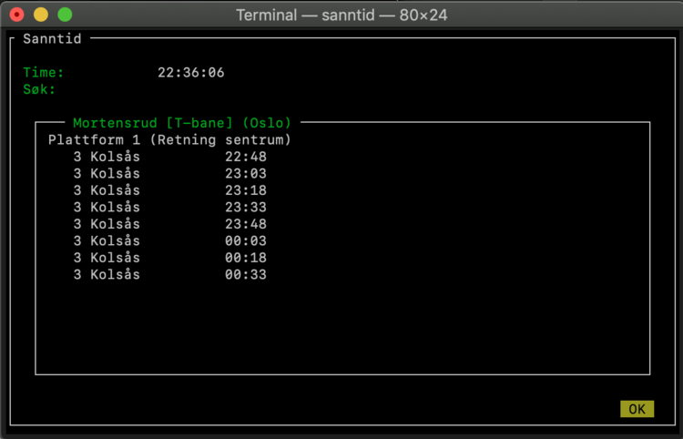

Dette programmet viser sanntidsinformasjon fra ruter i et terminalvindu.

Installasjon:
```bash
pip3 install npyscreen  # Trengs for terminal-GUI
pip3 install pendulum   # Trengs for fikle med tid og dato
pip3 install utm        # Trengs for å finne ut hvor du er
```

Kjøre programmet:
```bash
./sanntid
```


